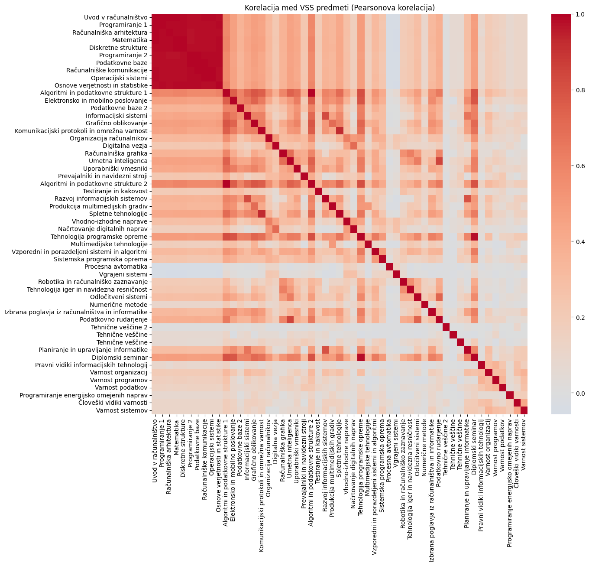
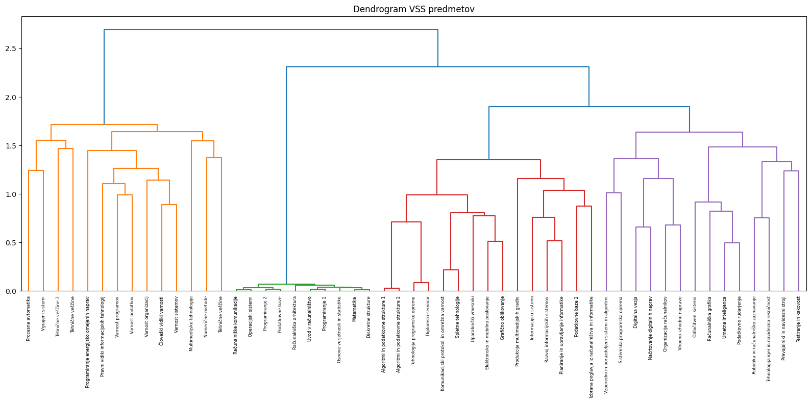
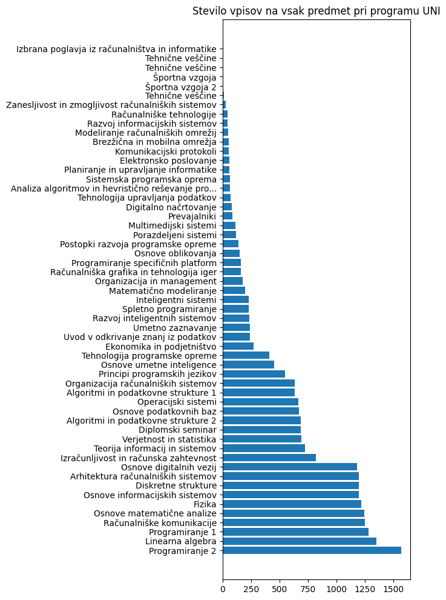
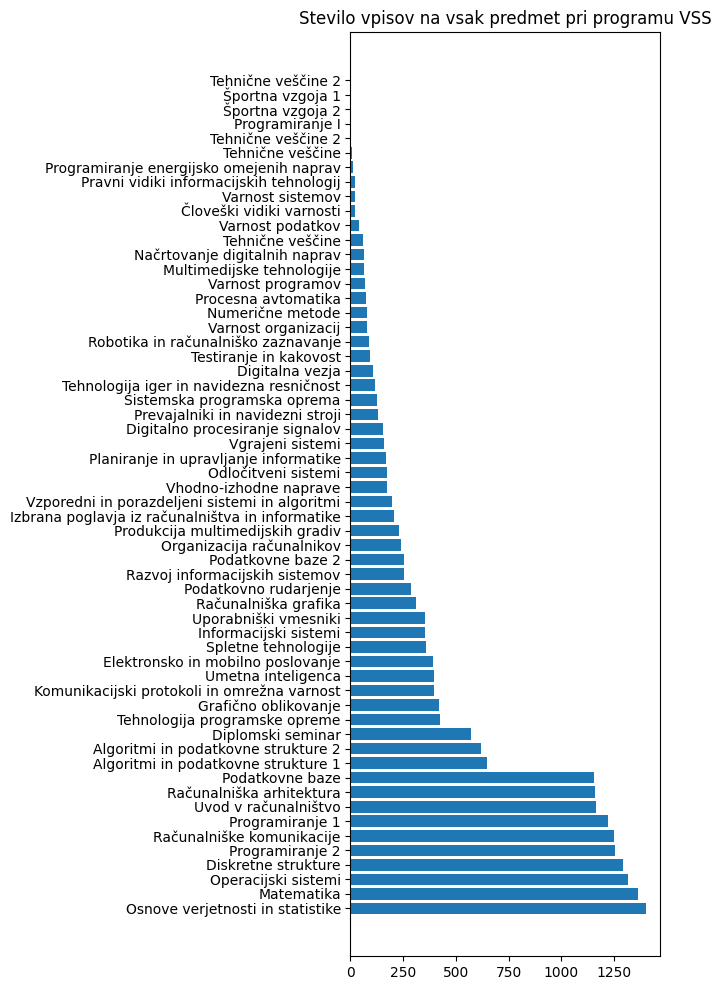
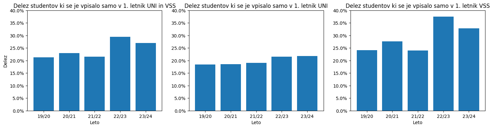

### 1. Problem

Naša skupina si je zadala nalogo analizirati urnik FRI in ugotoviti, katere vse podatke je možno pridobiti iz javnega urnika FRI. Spletna stran omogoča dostop do personaliziranih urnikov za posameznega študenta glede na njegovo vpisno številko ter izbrano šolsko leto in semester. Vemo, po kakšnem vzorcu si sledijo vpisne številke, kar nam je omogočilo dostop do predmetov, ki jih je študent imel v posameznem semestru. Omejili smo se na dodiplomska programa UNI in VSŠ.

### 2. Podatki

Na spletni strani urnika je naveden seznam urnikov iz prejšnjih let in semestrov, vendar so nekateri urniki testni in so prazni. Najprej smo pridobili seznam validnih urnikov za vsako leto in semester in jih shranili v csv datoteko. Ker je urnik za leto 2018 nepopoln, gledamo urnike med leti 2019 in 2024, torej v razponu 6 let.

Zgenerirali smo seznam študentskih vpisnih številk, ki smo jih želeli preveriti. Prvi dve številki `63` predstavljata fakulteto, naslednji dve številki predstavljata leto vpisa (2019 -> 19, 2020 -> 20 itd.). Sledi ena ničla, zadnje tri številke pa so unikatne in si sledijo v naraščajočem vrstnem redu.

Sedaj smo se lotili pridobivanja podatkov o predmetih vsakega študenta. Za vsakega študenta smo od leta njegovega vpisa naprej preverili, katere predmete je imel na urniku, in ekstrahirali identifikacijske številke predmetov. Dobili smo tabelo velikosti 3234 x 12.

Za lažje delo s predmeti smo ustvarili še csv datoteko, ki za vsak predmet navede identifikacijsko številko, ime predmeta, na katerem programu (UNI ali VSS) se predmet izvaja, v katerem semestru se izvaja, v katerih študijskih letih se je predmet izvajal ter v katerem letniku je predmet ponujen študentom.

### 3. Izvedene analize

Sedaj smo morali podatke pripraviti na obdelavo. V tabeli študentov je bilo veliko vrstic praznih, saj vpisna številka ne obstaja, rezultat pa je le prazen urnik. Vse take vrstice, kjer so bili vsi semestri prazni, smo odstranili. Poleg tega smo odstranili tudi študente, ki so imeli več kot 13 predmetov v enem semestru. Nekateri vnosi so bili nemogoči, saj so imeli "študentje" po 400 predmetov na urniku. Skupno je bilo odstranjenih 498 vrstic. Omejili smo se na študente programov UNI in VSŠ, torej smo morali poiskati študente na interdisciplinarnih programih in jih prav tako odstraniti. Izkaže se, da je FRI matična fakulteta za program IŠRM (Računalništvo in matematika), zato so le ti študentje imeli vpisno številko. Preverili smo njihov predmetnik in ugotovili kombinacijo predmetov, ki jih imajo v prvem semestru na FRI-ju. Poiskali smo vse študente, ki so v prvem semestru v letu vpisa imeli le predmeta Osnove digitalnih vezij in Programiranje 1. Odstranili smo 263 študentov IŠRM in tako dobili končno tabelo študentov.

Na podatkih smo izvedli tudi izračun korelacije in s pomočjo tega izrisali heatmap. Težko kaj preberemo iz slike, edino lahko sklepamo, da je prvih 10 predmetov na začetku obveznih v 1. letniku, saj so vsi močno korelirani med sabo. Predvidevamo še, da so Algoritmi in podatkovne strukture 1 in 2, Tehnologija programske opreme in Diplomski seminar obvezni predmeti v višjih letnikih. Za razliko od heatmapa pa je dendrogram veliko bolj v pomoč. Grupira skupaj predmete po podobnosti. Za VSŠ program je z zeleno barvo skupaj grupiral vse predmete 1. letnika in to z veliko podobnostjo. V oranžni skupini na začetku so manj pogosti oz. novejši izbirni predmeti, v ostalih skupinah pa so skupaj predmeti, ki so vsebinsko podobni in si na predmetniku sledijo s puščicami. Podobno opazimo za UNI predmete. Najbližje grupira predmete 1. letnika, sledijo predmeti 2. letnika, nato pa še modulski predmeti v skupinah po 4.

Analizirali smo število vpisov na vsak predmet na programu UNI in VSŠ, posebej. Na UNI odločno vodi Programiranje 2, nato sledi ostalih 9 predmetov iz 1. letnika. To je smiselno, saj je v 1. letniku največ študentov, ne gredo pa vsi naprej v 2. letnik. Zelo podobno stanje imamo na programu VSS, kjer nepresenetljivo vodi Osnove verjetnosti in statistike, sledijo pa ostali predmeti 1. letnika.  Preverili smo tudi, koliko je takih študentov, ki se vpišejo v 1. letnik in naslednje leto ne nadaljujejo študija. Vrednosti nihajo med približno 20% in 30%, kar je dobra petina oz. slaba tretjina, odvisno od leta.

Odločili smo se, da bomo izračunali tudi prehodnost predmetov oz. `pass rate`. Vzeli smo končno tabelo študentov, in jo "obrnili". Zdaj je vsaka vrstica predstavljala predmet, vsaka celica pa je vsebovala seznam študentov, ki so ta predmet imeli na urniku v določenem letu. Ker smo imeli podatke le o študentih, vpisanih od leta 2019 naprej, smo morali za predmete, ponujene v višjih letnikih izračunati zamik oz. `offset`. Za predmet, ki se izvaja v 3. letniku, ni smiselno računati prehodnosti leta 2019, ko imamo podatke samo o brucih. 

Na koncu pa smo za zabavo pri vsakem predmetu preverili še, kateri študent(je) ga najdlje opravlja(jo). Presenetljivo, ima nekaj ljudi isti predmet na urniku že od samega vpisa, torej 6 let. 

### 4. Najzanimivejši rezultati

Dobili smo veliko rezultatov, eni bolj zanimivi kot drugi. Osebno nas je zanimalo, kateri predmeti se največkrat ponavljajo na obeh programih. Razen diplomskega seminarja pri obeh, so na UNI-ju najpogostejši krivci Programiranje 2, Izračunljivost in računska zahtevnost ter Linearna algebra. (Iz osebnih izkušenj in anekdot lahko potrdim težavnost in neverjetno število ponavljalcev prvih dveh predmetov.) Na VSŠ-ju pa največji problem povzroča Računalniška grafika, ki je presenetljivo pred Osnovami verjetnosti in statistike. Če gledamo graf na Zgodovina predmeta v streamlit aplikaciji, je pri vseh predmetih opazen trend naraščanja ponavljalcev. Nekaj bi lahko razložila korona in povečanje vpisov, a le delno.

Iz izračunanih deležev ponavljanja za vsak predmet pa smo sestavili kalkulator, ki glede na izbrane predmete omogoča izračun verjetnosti, da bomo opravili predmet oz. letnik, če izberemo kombinacijo predmetov.

Pri analizi študentov, ki so študij pustili po enem letu, je bil zelo presenetljiv skok leta 2022/23 na programu VSŠ, ko je skoraj 40% študentov pustilo študij. V letnem poročilu za FRI 2024, je čista prehodnost na VSŠ programu leta 2022/23 znašala 33%, daleč najnižja v primerjavi z ostalimi leti. Že po samem številu vpisov vidimo, da se skoraj pol manj ljudi vpiše v 2. letnik, saj ponavljajo ali pa pustijo 1. letnik. To so kar visoke številke, a pričakovane za STEM študij.

Iz letnega poročila FRI za leto 2024 je razvidno, da je povprečen čas diplomiranja skoraj 5 let (trajanje študija je 4,29 let za UNI ter 4,24 let za VSŠ po zadnjem letnem poročilu FRI za leto 2024). Torej, ker je na tej fakulteti ponavljanje skorajda pričakovano, smo raziskali še, koliko je največje število let, da je študent opravljal predmet. Pri treh predmetih je ta številka 6, kar je ves časovni razpon, ki ga spremljamo. Trije študentje imajo od vpisa na fakulteto leta 2019 na urniku isti predmet, in to so Osnove matematične analize, Linearna algebra in Programiranje 2.  Vse to so UNI predmeti, na VSŠ-ju pa so študenti nek predmet opravljali maksimalno 5 let. To so Osnove verjetnosti in statistike, Operacijski sistemi, Diskretne strukture, Matematika ter Programiranje 1. Analizirali smo še tabelo ponavljalcev in dobili študente, ki se najpogosteje pojavijo. Nek študent je kar 7 predmetov opravljal maksimalno število let za tisti predmet.