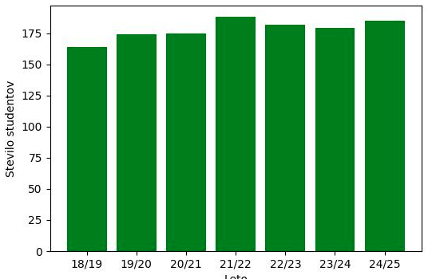
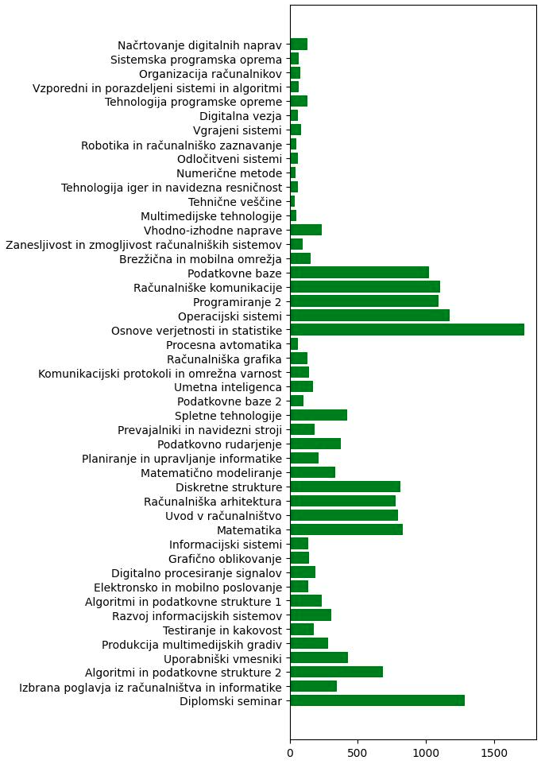

#### Analiza urnika in študentov FRI

##### Problem

Naša skupina si je zadala nalogo analizirati urnik FRI in ugotoviti, katere vse podatke je možno pridobiti iz urnikov študentov. Spletna stran omogoča dostop do personaliziranih urnikov za posameznega študenta glede na njegovo vpisno številko ter izbrano šolsko leto in semester. Vemo, po kakšnem vzorcu si sledijo vpisne številke ter lahko dostopamo do predmetov, ki jih je študent imel v posameznem semestru. Naša naloga je ugotoviti, kako iz tega lahko dobimo razne ostale podatke, kot so: trajanje študija v letih, čista prepustnost (koliko študentov, ki so prvič vpisani na program, napreduje v naslednji letnik) po letnikih in programih in kateri predmeti so najpogosteje izbrani. Omejili smo se na dodiplomska programa UNI in VSŠ.

##### Podatki

Najprej smo se lotili zbiranja podatkov o predmetih. Podatke smo dobili iz urnikov za 1., 2. in 3. letnik programa VSŠ med leti 2018/19 in 2024/25. Vsaka tako pridobljena vrstica, ki je predstavljala določen predmet, je vsebovala kratico, ime ter leto in semester izvajanja. 

Na podoben način smo pridobili smo še podatke o študentih. Z manipulacijo url-jev smo sestavili link z vpisno številko, letnico in semester. Ker iz vpisne številke lahko ugotovimo leto vpisa, smo omejili iskanje na leta po vpisu. Na koncu je vsaka vrstica vsebovala vpisno številko, kratico predmeta ter leto in semester izvajanja. Tabela ima dobrih 45.000 vnosov.

Po nadaljni analizi smo ugotovili, da se šifre ponavljajo in niso unikaten ključ, zato smo morali sestaviti nov načrt in se pridobivanja podatkov lotiti na drugačen način. Na domači strani urnika je sekcija Predmeti, kjer so v abecednem vrstnem redu našteti vsi predmeti na voljo v tem študijskem letu in semestru na naši fakulteti. Vnos je sestavljen iz polnega imena predmeta in njegove unikatne šifre. Pri pridobivanju podatkov smo tako na preprost način obdržali le predmete iz programov UNI in VSŠ. Dodali smo tudi seznam let, v katerih se je predmet izvajal. Velika večina predmetov se je izvajala vseh sedem let, ki jih spremljamo, ne pa vsi. Z manipulacijo url povezave smo šli na urnik predmeta v zadnjem letu, ko se je izvajal. Shranili smo vse šifre pod vnosi v urniku in iz njih ekstrahirali, za študente katerega programa in letnika je bil predmet na voljo.

Na podoben način se bomo lotili tudi pridobivanja podatkov o študentih. Naša glavna naloga bo ugotoviti, kdaj nehati spremljati študenta v smislu, ali je že diplomiral, pustil faks, ali pa nadaljeval študij na magisteriju.

##### Izvedene analize

Uporabili smo podatke, ki smo jih najprej pridobili, kljub pomanjkljivim šifram, saj je program za pridobitev podatkov o študentih časovno zelo zamuden in ga nismo imeli časa pognati še enkrat. Razmišljali smo, kaj lahko ugotovimo iz danih podatkov in prišli do dveh vprašanj. Prvo nas je zanimalo, koliko študentov se je vpisalo na VSŠ program čez leta. To smo ugotovili preprosto tako, da smo prešteli število vpisnih z dano letnico in podatke prikazali na grafu.

Drugo vprašanje, na katerega smo odgovorili, pa je bilo število vpisanih študentov po predmete. Pomagali smo si s slovarjem, kamor smo shranili predmet kot ključ in število vpisanih študentov kot vrednost. Tudi to smo prikazali na grafu.

##### Glavne ugotovitve

Do zdaj smo se ukvarjali z dvema vprašanjema, rezultate katerih smo tudi prikazali na grafih.

Prvi graf prikazuje število vpisanih študentov na program VSŠ skozi leta 2018 do 2024. Po višini stolpcev vidimo, da se število vpisanih ni bistveno spreminjalo po letih. Opazimo, da se višina stolpcev po letu 2021 povprečno dvigne. To sovpada z dvigom števila mest za vpis iz 150 na 170.

Drugi graf prikazuje število vpisanih študentov predmetov, ki so imeli dani predmet na urniku. Veliko predmetov ima precej kratke vrstice oz. malo število vpisanih študentov. Pri ostalih predmetov pa opazimo velik poskok pri vpisu. Izkaže se, da so to obvezni predmeti, kar razloži tako veliko razliko. Vsi študenti na programu morajo obiskovati določeno podmnožico predmetov, medtem ko se pri ostalih izbirnih predmetih študenti precej enakomerno porazdelijo. Zaradi velikega števila izbirnih predmetov je posledično v povprečju manj vpisanih študentov na predmet.